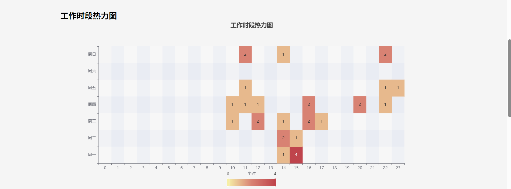
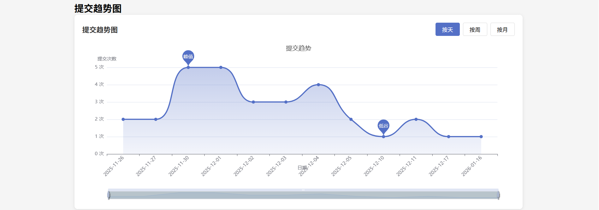
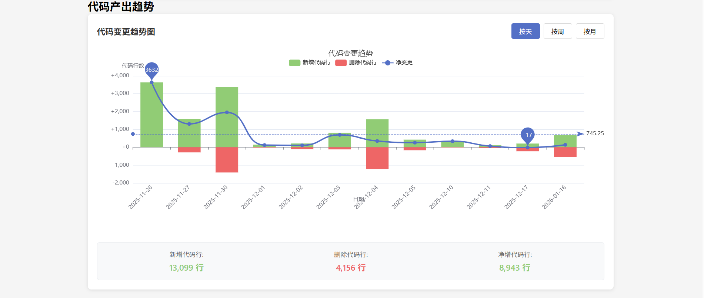

# workbeat

workbeat 是一个Git仓库工作节奏分析工具，用于分析团队成员的工作模式、代码贡献度和项目节奏，帮助了解开发效率和工作模式。

## 功能特性

- 分析Git仓库的提交历史
- 可视化团队成员的工作模式
- 生成HTML报告，支持离线查看
- 命令行界面，方便集成到工作流
- 支持Web可视化界面

## 安装

### 前置要求

- Node.js >= 18.0.0
- pnpm (推荐) 或 npm

### 克隆和安装

```bash
# 克隆项目
git clone <repository-url>
cd workbeat

# 安装所有依赖 (包含前端UI)
pnpm run install:all
# 或者分别安装
pnpm install
cd web-ui && pnpm install
```

## 使用方法

### 基本用法

```bash
# 分析单个仓库并输出到控制台
npx workbeat /path/to/repo

# 启动Web可视化服务器
npx workbeat /path/to/repo --serve

# 指定端口启动Web服务器
npx workbeat /path/to/repo --serve --port 8080

# 生成HTML报告
npx workbeat /path/to/repo --report
# 或指定输出路径
npx workbeat /path/to/repo --report /custom/path/report.html

# 安静模式（仅输出必要信息）
npx workbeat /path/to/repo --quiet

# 包含所有分支的提交记录
npx workbeat /path/to/repo --all

# 解析详细的文件变更信息
npx workbeat /path/to/repo --detail

# 使用特定时间范围分析（例如：分析2023年的提交）
npx workbeat /path/to/repo --git-args "--since=2023-01-01 --until=2023-12-31"

# 组合使用多个选项
npx workbeat /path/to/repo --all --detail --report ./my-report.html
```

### 选项说明

- `--serve, -s`: 启动Web可视化服务
- `--port <number>`: 指定Web服务端口（默认3000）
- `--report [path]`: 导出HTML报告到指定路径，如果不指定则默认为当前目录下的workbeat-report.html
- `--quiet, -q`: 安静模式，仅输出必要信息
- `--all, -a`: 包含所有分支的提交记录，默认为false
- `--detail, -d`: 解析详细的文件变更信息，默认为false
- `--git-args <args>`: 透传给git log的参数（只支持--since, --until, --after, --before）
- `--help, -h`: 显示帮助信息
- `--version, -V`: 显示版本号

### 注意事项

- `--serve` 和 `--report` 选项不能同时使用
- HTML报告生成后可在浏览器中直接打开，无需网络连接
- 生成的报告完全自包含，包含所有CSS、JS和数据

## 项目结构

```
workbeat/
├── bin/                    # CLI入口脚本
├── dist/                   # 构建输出目录
│   ├── static/            # 前端构建静态文件
│   └── ...                # 后端构建文件
├── src/                   # 源代码目录
│   ├── cli/              # CLI命令行界面
│   ├── core/             # 核心分析逻辑
│   ├── server/           # Web服务器实现
│   ├── types/            # 类型定义
│   ├── visualizer/       # 可视化相关代码
│   └── index.ts          # 主入口文件
├── web-ui/               # Vue前端项目
│   ├── src/              # 前端源码
│   ├── public/           # 静态资源
│   └── ...               # 前端构建配置
├── scripts/              # 构建脚本
├── package.json          # 项目配置
├── tsconfig.json         # TypeScript配置
└── tsup.config.ts        # 构建工具配置
```

## 开发指南

### 本地开发

```bash
# 安装所有依赖
pnpm run install:all

# 修改后构建项目
pnpm run build

# 启动分析
pnpm run start . -d -s
```

### 项目架构说明

1. **CLI模块 (`src/cli`)**: 命令行解析和用户交互
2. **核心分析 (`src/core`)**: Git仓库分析逻辑
3. **服务器 (`src/server`)**: Web服务器和数据注入
4. **可视化 (`src/visualizer`)**: HTML报告生成器
5. **前端 (`web-ui`)**: Vue.js可视化界面


## 界面截图






## 许可证

MIT